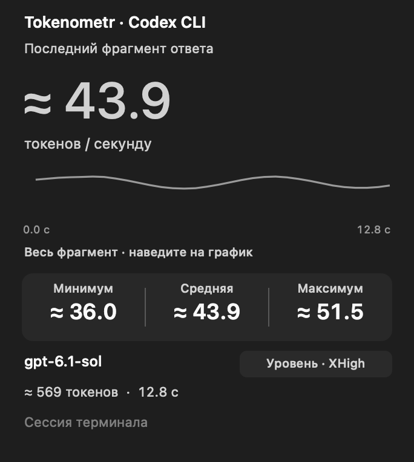

# Tokenometr

Маленькое нативное приложение для macOS: самостоятельно измеряет скорость поступления текста из Codex и показывает `≈ 42.1 т/с` в строке меню. Swift + AppKit, без сервера, API-ключа, Electron и зависимостей на сторонние среды исполнения.

Поддерживает Codex Desktop и Codex CLI. В карточке — модель, уровень рассуждения, минимум / средняя / максимум, график со статистикой при наведении и сохранение последнего замера.

**macOS 13 или новее · готовая сборка для Apple Silicon · приложение около 4 МБ.**



*Скриншот с демонстрационными данными.*

## Запуск

1. [Скачайте Tokenometr 0.2.0 для Mac с Apple Silicon](https://github.com/oxgeneral/Tokenometr/releases/download/v0.2.0/Tokenometr-0.2.0-macOS-arm64.zip) и распакуйте архив.
2. Перенесите `Tokenometr.app` в папку «Программы» и откройте его.
3. Откройте чат Codex или запустите обычный `codex` в терминале и начните генерацию.

Tokenometr появляется в строке меню. По нажатию на значок доступны источник, модель, уровень рассуждения, график, число токенов, минимум / средняя / максимум и автозапуск. Терминал, Xcode и API-ключ для готовой сборки не нужны.

Готовая сборка пока не подписана сертификатом разработчика Apple и не нотарифицирована: macOS может запросить отдельное разрешение при первом запуске.

Для запуска из исходников нужны Apple Command Line Tools:

```sh
git clone https://github.com/oxgeneral/Tokenometr.git
cd Tokenometr
./scripts/build.sh
```

После сборки откройте `dist/Tokenometr.app` или дважды нажмите `Open.command`. Скрипт сборки использует архитектуру текущего Mac; опубликованный архив содержит только сборку `arm64`.

## Собственный замер

Приложение подключается к существующему локальному IPC-каналу десктопного Codex и подписывается на последний обновлённый пользовательский чат. Оно получает текстовые изменения, считает токены локальным BPE-токенизатором OpenAI `o200k_base` и измеряет время монотонными часами. Число событий потока не принимается за число токенов. Повторные события отбрасываются по ревизии, полный текст пересчитывается с учётом объединения токенов между порциями.

Во время поступления текста показана скорость за последние две секунды; после фрагмента ответа остаётся его средняя скорость. Время до первого поступления текста, вызовы инструментов, их вывод и скрытые reasoning-токены не включены. Первая порция служит временной и числовой точкой отсчёта, поскольку время генерации её отдельных токенов неизвестно. Нельзя измерить скрытые токены по потоку видимого текста.

В выплывающей карточке под графиком показаны минимум, средняя и максимум в т/с. Минимум и максимум фиксируются по скоростям окна при наблюдаемом поступлении текста; ожидание и обновления интерфейса не создают новые экстремумы. Последний полноценный замер остаётся после завершения ответа и начала следующего сообщения, пока новое сообщение не даст достаточно данных для своего замера. При этом показано «Сохранённый замер», а график остаётся доступен для наведения. Каждый новый замер имеет собственные минимум, максимум и временные отметки: скорость разных фрагментов не смешивается. Если сохранённого результата нет и данных ещё недостаточно, показано «—».

Для каждого из последних 32 чатов сохраняется один замер: токены, время, средняя, минимум, максимум и до 512 точек графика. Он переживает новые снимки состояния Codex, переподключение и перезапуск приложения. Файл `~/Library/Application Support/Tokenometr/statistics.json` содержит только числовые данные, идентификаторы и сведения о модели; текст ответов не записывается. Записи объединяются с интервалом две секунды; обычное завершение приложения сохраняет оставшиеся изменения сразу.

Подписка восстанавливается при переподключении окна Codex и по его запросу списка наблюдателей. Каждые 30 секунд она также обновляется на случай тихой потери подписки. Повторный снимок той же ревизии сохраняет последний замер и график; при смене владельца потока, сбросе счётчика событий окна или пропущенных событиях устанавливается новая точка отсчёта.

Рядом с моделью отображается выбранный в Codex уровень рассуждения (`Low`, `High`, `XHigh` и другие). Он читается из живых метаданных ответа и настроек чата. Если Codex оставляет поле потока пустым, используется сохранённый `reasoning_effort` именно этого чата из локальной базы; глобальные настройки не подставляются. Уровень обновляется без сброса скорости и графика. Если ни один источник не содержит значения, указано «не указан».

График содержит реальные временные отметки поступлений текста за последнюю минуту текущего фрагмента. Наведите на точку: выделится окно около двух секунд, под графиком появятся его границы и число токенов, а ряд минимума / средней / максимума покажет статистику этого интервала. Пока указатель на графике, его история зафиксирована для удобного просмотра. При уходе указателя возвращается сводка всего фрагмента. Время измеряется от первой наблюдаемой порции; границы интервала соответствуют поступлениям, промежутки не заполняются выдуманными токенами. При наведении на значок в строке меню также доступны модель, уровень и сводка последнего интервала.

Знак `≈` показан всегда: приватный токенизатор конкретной модели Codex может отличаться от опубликованного `o200k_base`; приложение измеряет скорость доставки текста пользователю, которая также зависит от буферизации. Точные серверные показатели usage для вычисления скорости не используются.

## Codex CLI

CLI подключается автоматически через существующий локальный app-server daemon. Обёртки, дополнительный сервер и изменение команды `codex` не нужны. Проверена версия `codex-cli 0.160.0`. Поддерживаются обычная сессия и возобновление сессии: современные терминальные сессии в общем сервере могут иметь историческую отметку `vscode`, поэтому она также учитывается.

Tokenometr проверяет стандартный `$CODEX_HOME/app-server-control/app-server-control.sock` (по умолчанию `~/.codex`) и локальные дома аккаунтов Orca. Для нестандартного `CODEX_HOME` приложение можно запустить с этим значением окружения. Ссылки на сокет и длинные пути аккаунтов поддерживаются. Подписка выполняется только для уже загруженных пользовательских сессий; хранимые закрытые чаты и вспомогательные агенты не запускаются. В одном локальном сервере отслеживается до восьми пользовательских сессий; читается их текущая модель и уровень.

У двух источников общий интерфейс и одинаковый собственный замер: в CLI считаются только живые `item/agentMessage/delta` и `item/plan/delta`. Полные тексты в ответе подписки, события завершения, usage, рассуждения и вывод инструментов не создают точки скорости. Все показатели и график сохраняются так же, как у десктопных чатов. Источник переключается по последнему наблюдаемому поступлению текста, а название `Codex` / `Codex CLI` видно в карточке и подсказке значка. Ожидание, обновление настроек и служебные события сами по себе источник не переключают.

## Ограничения

Проверено с локальным десктопным Codex и Codex CLI на этом Mac. Десктопный IPC протокол внутренний, версия потока 11: обновление Codex может потребовать изменения адаптера. Чат должен быть открыт в Codex, чтобы его владелец публиковал изменения. CLI требует локального общего app-server daemon: `codex --no-daemon`, отдельный `codex exec`, старые версии без общего сервера и удалённые WebSocket-серверы не отслеживаются. В отсутствие совместимого потока показывается ожидание, вымышленные числа не подставляются. Другие клиенты того же общего сервера также могут публиковать наблюдаемый текст: название `Codex CLI` обозначает этот канал, а не проверку активного окна терминала.

Tokenometr не меняет настройки Codex, не запускает генерацию, не принимает запросы на управление чатами, не сохраняет тексты и не обращается к сети. Для обнаружения последнего чата читает его идентификатор, название и сохранённый уровень рассуждения из локальной SQLite-базы в режиме read-only. Все тексты для подсчёта живут в памяти процесса.

## Разработка

Нужны уже установленные Apple Command Line Tools; Xcode-проект и менеджер пакетов не требуются.

```sh
./scripts/build.sh
./scripts/test.sh
python3 scripts/integration-test.py
python3 scripts/cli-integration-test.py
./dist/Tokenometr.app/Contents/MacOS/Tokenometr --diagnose --duration 15
```

Диагностика выводит только состояние подключения и числовые метрики. Терминал и Python не нужны для обычного запуска приложения.

Интеграционный тест использует только стандартную библиотеку Python и временный локальный IPC-канал. Проверяет нативную сборку, восстановление соединения и подписки без разрыва сокета, замену окна Codex, сохранение статистики при обновлении подписки, смену чата, повторы, пропущенные события, Unicode и исключение инструментов. Реальные настройки и база Codex при этом не изменяются. Результат сохраняется в `artifacts/integration-results.json`.

Тест CLI использует временный Unix WebSocket и проверяет подписку без переопределения настроек, маскирование, ping/pong, сокет через ссылку и длинный путь, исключение истории и служебных событий, собственную скорость, сохранение, восстановление подключения и перезапуск. Результат записывается в `artifacts/cli-integration-results.json`.

Словарь токенизатора: [OpenAI tiktoken](https://github.com/openai/tiktoken), лицензия MIT приложена в `Resources/tiktoken-LICENSE.txt`. События app-server описаны в [официальной документации](https://learn.chatgpt.com/docs/app-server); десктопный IPC адаптер проверен по установленной версии приложения.
